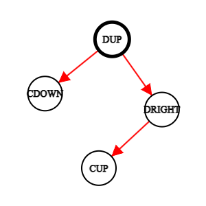

# TrafficJam

## TrafficJam este un minigame 2D reprezentat intr-u dictionar auto interactiv, unde user-ul trebuie sa selecteze ordinea in care autoturismele au prioritate in interiorul unei intersectii.

### -> Toate scenariile sunt generate random pe baza unui algoritm pe grafuri.
##### Fiecare directie de deplasare are ca frunze masinile asociate acesteia, acestea la randul lor sunt parcurse printr-un algoritm pe principiu BFS. Directiile sunt mapate pe numere astfel: UP -> 1 RIGHT -> 2 DOWN -> 3 RIGHT -> 4
##### Pe princiu BFS nodurle masinilor cu aceiasi destinatie sunt sortate crescator in ordinea prioritatii. Acestea sunt memorate intr-o structura std::deque ce ne va permite ulterior implementarea mecanicii de drum cu prioritate prin metoda push_front().

The minigame will randomly generate traffic intersection scenarios in which the user will have to answer the correct priority order
Internally it knows the needed **EU regulations**
## Model:

Here we have a few real-life example of intersections that we want to generate:


- Firstly, it needs at least a direction that vehicles have to follow
- Secondly, it needs at least 2 vehicles with a colliding route as shown above

## Technical:

- **Every direction and vehicle represents and object
- **We link them one to each in a tree like manor
- We determine priority order of multiple cars going in the same direction by their index
- In general, priority is ordered by the level where the object is found on the tree



### C++ integration:
```c++
std::deque<'type'> cars;
std::vector<'type'> dirs;
```
